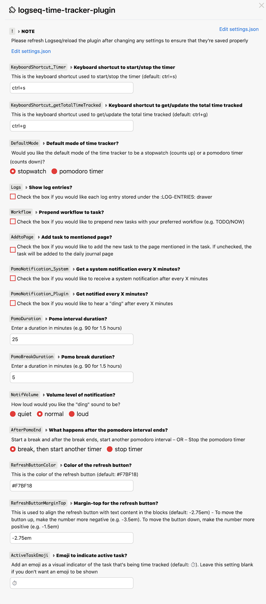

## logseq-time-tracker-plugin
- [Demo videos](https://loom.com/share/folder/9644cc808d254e17826e1aeb4fba394c)

## Core Features
> The **_time tracked_** and **_total time tracked_** are inserted as a block property in the following notation: `hours:minutes:seconds` (e.g. 00:17:32 → 17 minutes and 32 seconds)

### 2 Time Tracking Modes
> Easily switch between the 2 time tracking modes by clicking on the *letter next to the stopwatch icon in the toolbar  

- #### Stopwatch (*S)
    - This mode counts up time
- #### Pomodoro Timer (*P)
    - This mode counts down time [(additional info)](https://en.wikipedia.org/wiki/Pomodoro_Technique)
    - The length of the pomodoro and break interval can be configured in the [settings](#settings)

### Keyboard shortcuts to start/stop the timer and get/update the total time tracked
- Usage: click on the task (as if to edit it) → activate the keyboard shortcut (can be configured in the [settings](#settings))

### Start and stop tracking time for a <u>_new_</u> or <u>_existing_</u> task in 3 ways:
- Block context menu (right-click on bullet)
- Plugin UI
    - New tasks created via the plugin UI are added to the daily journal page by default (but can be added to a specific page) and can be prepended with your preferred workflow (e.g. TODO/NOW) - these features can be configured in the [settings](#settings)
- Slash (/) command  
#### Demo

> The emoji displayed next to the task being time tracked can be configured in the [settings](#settings)

### Get and update the total time tracked for a parent task with child(ren) tasks in 2 ways:
- Block context menu (right-click on bullet)
- Slash (/) command  
- After getting the total time tracked for the first time, an inline refresh button will appear to make it easier to update the total time tracked (the color and position of the button can be configured in the [settings](#settings))
    - 🚨 <u>**NOTE:**</u> Always use the block context menu or slash command to get the inital total time tracked. Please do **NOT** copy and paste `{{renderer :refreshTotalTimeTracked}}` to other blocks

#### Demo

## Additional Features
> These additional features are **_disabled by default_** and can be configured in the [settings](#settings)

### Show log entries that mirror Logseq's native time tracking functionality
 _Task state: TODO (red checkbox)_

### Get notified after a customizable interval of time
- Similar to a pomodoro timer - a **"ding"** sound will play and/or a **system notification** will appear at the end of _**each**_ interval (e.g. every 25 minutes), but the stopwatch will continue to track time until you stop the timer

## Installation
### Preparation
1. Click the 3 dots in the righthand corner → `Settings` → `Advanced` → Enable `Developer mode` and `Plug-in system`
2. Click the 3 dots in the righthand corner → `Plugins` – OR – Use keyboard shortcut `Esc t p`

### Load plugin via the marketplace (not available yet)

### Load plugin manually
1. Download the [latest release](https://github.com/vyleung/logseq-time-tracker-plugin/releases) of the plugin (e.g logseq-time-tracker-plugin-v.1.0.0.zip) from Github
2. Unzip the file
3. Navigate to plugins (Click the 3 dots → `Plugins` – OR – Use keyboard shortcut `Esc t p`) → `Load unpacked plugin` → Select the folder of the unzipped file

#### Settings
- Each time you make changes to the plugin settings, please reload the plugin to ensure that all settings are updated  

## License
MIT

##  Credits
- Plugin Marketplace Icon: <a href="https://www.flaticon.com/free-icons/stopwatch" title="stopwatch icons">Stopwatch icons created by Freepik - Flaticon</a>
- Icons used in the plugin: [Tabler Icons](https://tablericons.com/) and [Feather Icons](https://feathericons.com/)

## Support
If you find this plugin useful, consider buying me a coffee 🙂  
